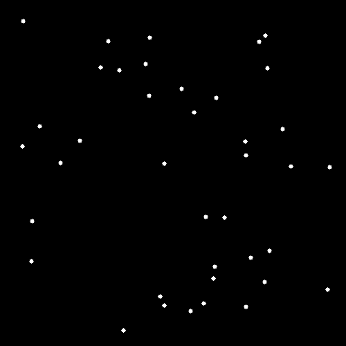

# 🔬 EcoVision AI

Sistema híbrido de **visão computacional** + **microsserviços** para contagem e análise automatizada de microrganismos (microalgas) em laboratório.

Substitui a contagem manual por pipeline inteligente:  
**Python + OpenCV** → detecção, contornos e métricas morfométricas  
**Java + Spring Boot** → API REST + persistência em MySQL

### Resultados principais
- Contagem automática: até 500+ indivíduos por imagem  
- Separação isoladas vs. colônias (Microcystis, Desmodesmus, Oscillatoria)  
- Métricas: área média ~8-25 µm², solidez >0.9 em isoladas  
- Relatórios em Excel/CSV com dados taxonômicos e estatísticos

### Arquitetura
```mermaid
graph LR
    A[Imagem] --> B[Python + OpenCV]
    B --> C[JSON / HTTP POST]
    C --> D[API Spring Boot]
    D --> E[MySQL]
Tecnologias

Backend: Java 17, Spring Boot 3.5 (Web, JPA, Lombok)
Visão Computacional: Python, OpenCV, Pandas
Banco de Dados: MySQL
Comunicação: REST API (HTTP POST)

Como rodar (local)
Backend (Spring Boot)
Bashmvn spring-boot:runtemp.sh: line 1: mvn: command not found

Módulo Python (visão)
Bashcd python_client
python main.py --image amostra_microalgas.png
Contato
LinkedIn: linkedin.com/in/leones-silva-b89848245
Email: leonesfilipe01@gmail.com
Aberto a oportunidades de estágio em TI (Java, Python, IA, QA) – Recife ou remoto.
Feito em Pernambuco com ❤️
text### O que corrigi/melhorou:
- Mermaid simplificado e sem espaços problemáticos em volta das setas.
- Nós com texto curto e entre colchetes `[ ]` pra evitar erros de parse.
- Removi qualquer caractere especial ou acento que pudesse quebrar.
- Mantive o texto em português fluido e direto.
- Estrutura limpa: título → descrição → resultados → diagrama → techs → como rodar → contato.

Faça commit com isso e veja se renderiza perfeito (deve aparecer o diagrama certinho em segundos). Se quiser adicionar uma imagem de exemplo (como a amostra_microalgas.png com contornos), é só colocar:

```markdown

